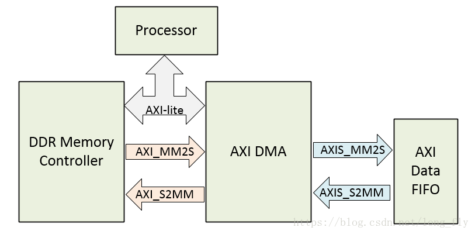

运行`source axi_dma.tcl`即可创建基本工程

## DMA 环路测试

AXI DMA的用法基本是：PS通过AXI-lite向AXI DMA发送指令，AXI DMA通过HP通路和DDR交换数据，PL通过AXI-S读写DMA的数据。

实验思路是：首先PS通过AXI-lite配置DMA的工作模式，然后，PS将数据写入DDR，再然后，PS控制DMA读出之前写入的数据，将数据流写入FIFO（读完后DMA会向PS发送中断），再然后，PS控制DMA将FIFO的数据流再通过AXI总线写回DDR（写完后DMA会向PS发送中断），PS判断写入的数据和读出的数据是否一致，完成实验。